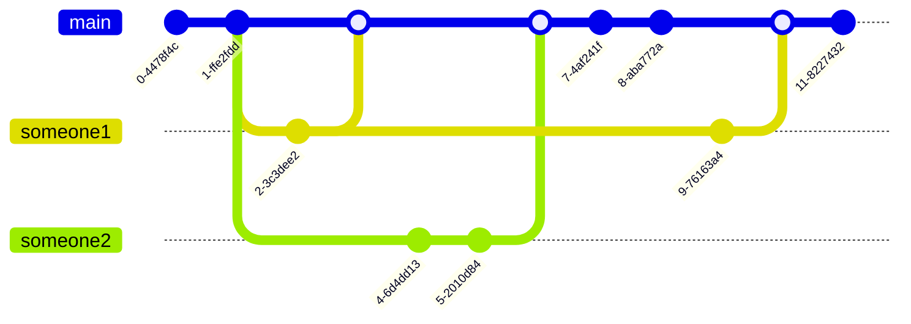

# 如何贡献我的文章？
**你只需要新建一个Pull Requests，知乎更改好需要的内容，提交后合并分支。**
嘿……这段文字好无聊，有没有更直观的？

就像上图那样main主线作为本仓库共全部读者观看，someone1和someone2代表两位创作者，可以方便快捷的对工程创建*分支*，进行修改，之后在提交，与main主线的内容合并。  
只需要点击此页的Pull Requests，克隆一个你的文档，在web IDE中进行修改，并提交merge申请即可参与到创作中！